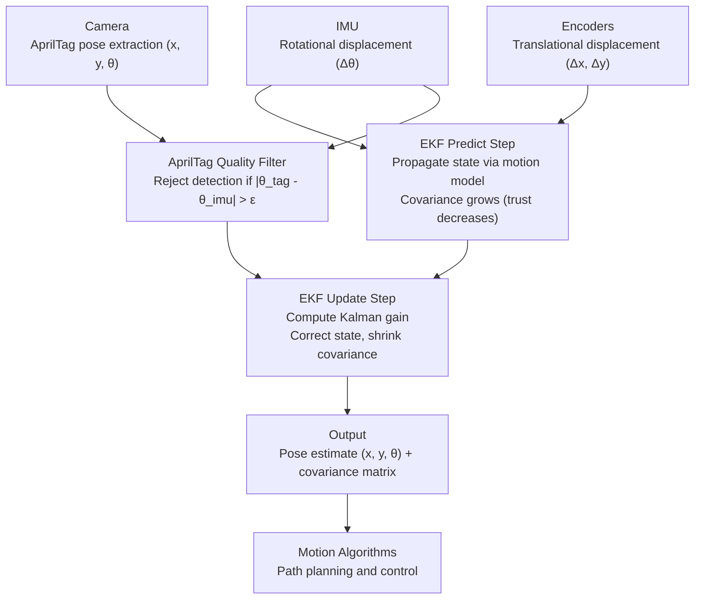

# GATR1-EKF-Localization

### What is an EKF and why are we using one?

A robot needs to know where it is at all times. The challenge is that sensors are imperfect.

An **Extended Kalman Filter (EKF)** is a recursive state estimator that fuses multiple noisy measurements into a single optimal estimate. It is the "extended" variant of the standard Kalman Filter because our motion model is nonlinear (rotating a robot and then translating it does not compose linearly), so the EKF linearizes the system at each timestep.

The filter maintains two things at all times: a **state estimate** (our best guess of the robot's pose) and a **covariance matrix** (our uncertainty about that estimate). Each timestep runs two phases:

1. **Predict** uses the motion model driven by encoder and IMU data to propagate the state forward in time. Because motion models are imperfect, the covariance grows during this phase, reflecting increased uncertainty the longer we go without a measurement.
2. **Update** incorporates a new sensor measurement (an AprilTag pose) to correct the predicted state. The Kalman gain balances how much we trust the prediction versus the measurement, and the covariance shrinks after a successful update.

The output at every timestep is a full **probability distribution** over the robot's pose: a mean (x, y, θ) representing the most likely pose, and a covariance matrix encoding uncertainty in each dimension.  

---

#### I thought of an analogy I quite like for explaining this approach.  
Localization in robotics is similar to the refinement process within a factory. 

> The first thing you do when trying to eliminate product defects is optimize the production process as much as possible. For us, that means making our odometry as robust as it can be. But we have to acknowledge that no process is ever perfect. Just like manufacturing machines wear down over time and introduce inconsistencies,
> robots do too.  
>
> The world is inherently noisy, and no deterministic solution will ever get you to zero error. You can't optimize your way out of uncertainty.
> 
> To account for this, factories put systems in place specifically to catch and handle anomalies rather than assuming the manufacturing process is flawless. The EKF will do the same. It starts from the assumption that the world is naturally noisy and continuously makes checks to increase or decrease trust in our current
> estimate based on what the sensors are telling us. Instead of assuming that our odom (the process) is perfect, we prepare for the times when it's not using an EKF (anomaly detector).

## Architecture

### TO-DO

- AprilTag Detection (*THIS WILL REQUIRE A LOT OF TUNING + REFINEMENT*)
- AprilTag Pose Extraction

- Assemble Odometry Tracking Setup
- Test + Refine Odom Performance

- Implement EKF Structure
- Component Integration - Test Odom + AprilTag Update

- Comparative Analysis - "Is there a clear improvement in localization over time with the EKF setup?"
